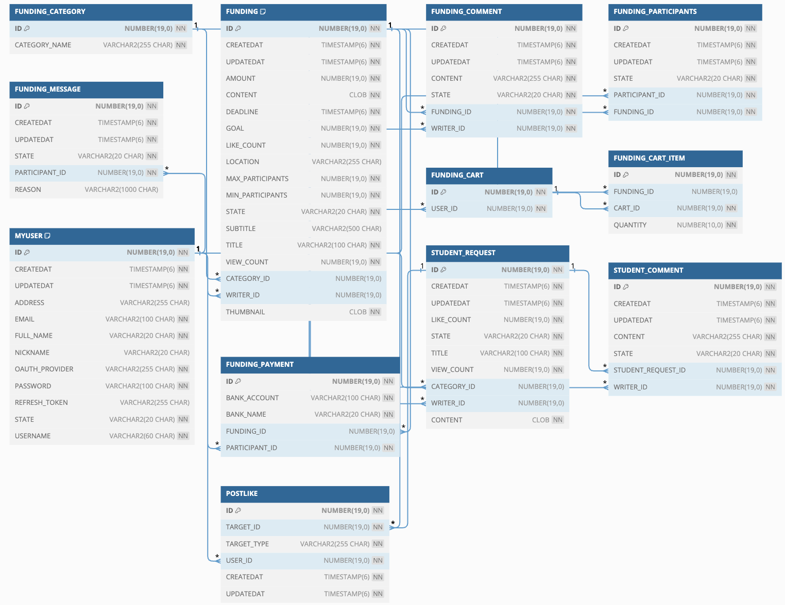

### 강츄(GangChew)- 펀딩 강의 개설 웹 프로젝트

### REST API
REST API를 처리하는 SpringBoot 프로젝트   


- 도메인 폴더 구조
> Controller - Service - Repository


## Structure

```text
api-server-spring-boot
  > * build
  > gradle
  > src.main.java.com.example.final_project
    > common
        > config
          | RestTemplateConfig.java
          | SecurityConfig.java
          | SwaggerConfig.java
          | WebConfig.java
        > entity
          | BaseEntity.java
        > exceptions
          | BaseException.java
          | ExceptionAdvice.java
        > jwt
          | JwtAuthenticationFilter.java
          | JwtAuthenticationToken.java
          | JwtUtil.java
        > oauth
          | KakaoOauth.java
          | NaverOauth.java
          | OAuthService.java
          | SocialOauth.java (interfece)
        > response
          | BaseResponse.java
          | BaseResponseStatus.java
        | Constant.java
    > security
        | CustomAuthenticationProvider.java
        | CustomUserDetailService.java
    > src
      > user
        > entity
          | User.java // User Entity
        | UserController.java
        | UserService.java
        | UserRepository.java
        
      > funding
        > entity
          | Funding.java // Funding Entity
        | FundingController.java
        | FundingService.java
        | FundingRepository.java
        
      > funding_cart
        > entity
        | FundingCartController.java
        
      > funding_message
      
      > post_like
      > student_request
      
    > utils
      | JwtService.java // JWT 관련 클래스
      | SHA256.java // 암호화 알고리즘 클래스
      | ValidateRegex.java // 정규표현식 관련 클래스
    | DemoApplication // SpringBootApplication 서버 시작 지점
  > resources
    | application.yml // Database 연동을 위한 설정 값 세팅 및 Port 정의 파일

```
## ERD



